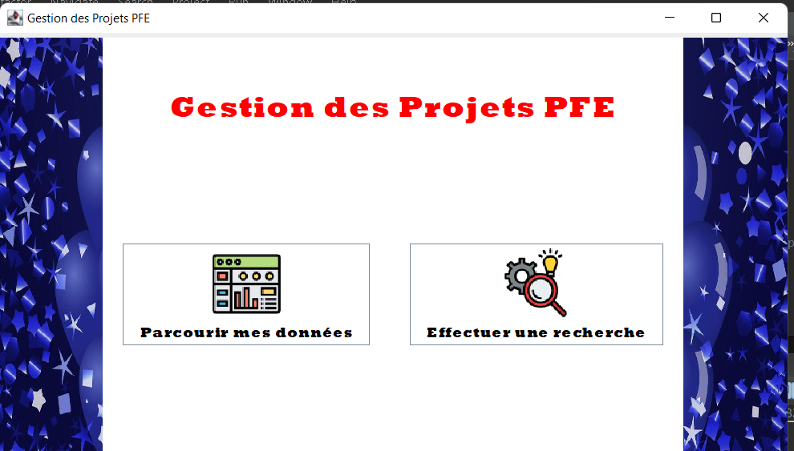
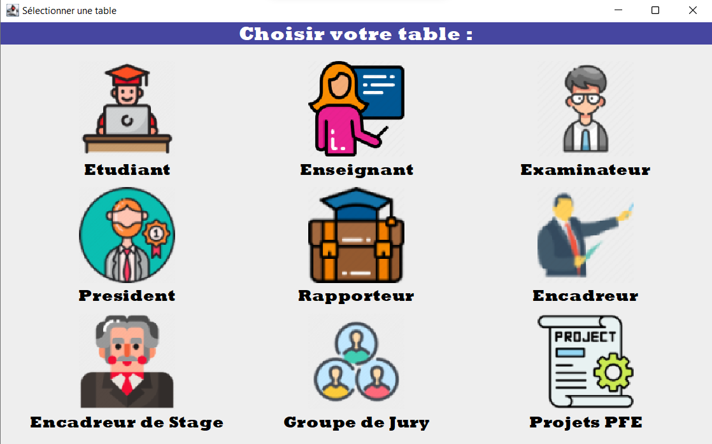

# gestion-des-PFE--JAVA
# PFE Management Platform - 
💻✨ **Final Year Project Management Application – Java Swing Mini Project**

As part of my studies at the Higher Institute of Computer Science and Mathematics of Monastir (ISIMM), I developed a complete application using Java Swing to manage final-year student projects (PFE).

---

### 📌 Objective:
Design a user-friendly interface to manage and navigate all data related to final-year projects, including:

- 🧑‍🎓 Students  
- 👨‍🏫 Teachers  
- 🧑‍⚖️ Examiners & Jury Presidents  
- 🕵️ Rapporteurs & Supervisors  
- 📋 Project descriptions and follow-up  

---

### 🧩 Main Features:
- 🔐 **Login & Registration System**
- 🏠 **Main Dashboard:** Browse or search project-related data  
- ➕➖📝 **Full CRUD Functionality:** Add, update, delete entries in all tables  
- 🔎 **Smart Search:** Filter data based on custom criteria for easy access  

## 🖥️ Screenshots  
| Main Window | Login Screen |  choisir table 
|-------------|--------------|--------------|  
|  |  |  |


## 🔧 Features  
- **Role-based access**: Admins, students, and professors.  
- **Database operations**:  
  - Browse tables (`etudiants`, `enseignants`, `projets_pfe`, etc.).  
  - Search functionality.  
  - Statistics generation.  
- **MySQL integration**: Uses JDBC for CRUD operations.  

## 🛠 Technologies  
- **Frontend**: Java Swing (NetBeans GUI builder + manual Swing code).  
- **Backend**: JDBC (MySQL connector).  
- **Database**: MySQL (see `database/projet.sql` for schema).  

## 🚀 How to Run  
1. **Prerequisites**:  
   - Java JDK 8+  
   - MySQL Server (import `database/projet.sql`).  

2. **Steps**:  
   ```bash
   git clone https://github.com/yourusername/PFE-Management-Platform.git
