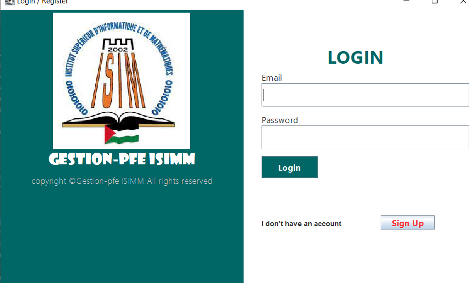

# gestion-des-PFE--JAVA
# PFE Management Platform - ISIMm  
*A Java Swing application for managing final-year projects (PFE) at our University.*  

## 🖥️ Screenshots  
| Main Window | Login Screen |  
|-------------|--------------|  
|  |  |  

## 🔧 Features  
- **Role-based access**: Admins, students, and professors.  
- **Database operations**:  
  - Browse tables (`etudiants`, `enseignants`, `projets_pfe`, etc.).  
  - Search functionality.  
  - Statistics generation.  
- **MySQL integration**: Uses JDBC for CRUD operations.  

## 🛠 Technologies  
- **Frontend**: Java Swing (NetBeans GUI builder + manual Swing code).  
- **Backend**: JDBC (MySQL connector).  
- **Database**: MySQL (see `database/projet.sql` for schema).  

## 🚀 How to Run  
1. **Prerequisites**:  
   - Java JDK 8+  
   - MySQL Server (import `database/projet.sql`).  

2. **Steps**:  
   ```bash
   git clone https://github.com/yourusername/PFE-Management-Platform.git
